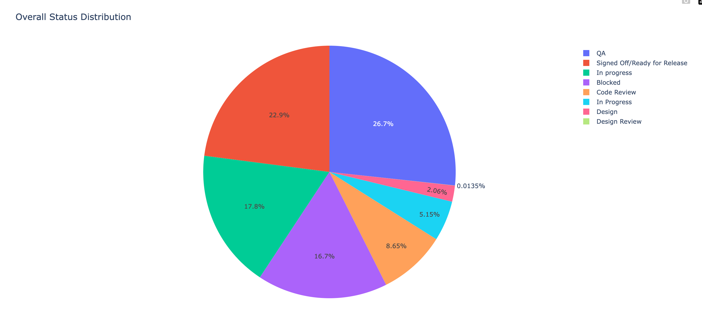

# JIRA Data Analysis Script

This script interacts with the JIRA API to retrieve, analyze, and visualize issue data, releases, and status changes for a specified project and time periods. It generates tables, CSV files, and interactive pie charts to help you gain insights into your project's progress and status distribution.

## Features

- Fetches JIRA issue data, status changes, and release information.
- Calculates time spent in different statuses, excluding specified statuses.
- Generates tables displaying release details and associated tickets.
- Creates a CSV file containing processed issue data.
- Generates interactive pie charts to visualize status distribution.

## Prerequisites

- Python 3.x
- Required Python packages: `argparse`, `dateutil`, `pandas`, `plotly`, `requests`

## Usage

1. Clone this repository or download the script.
2. Install the required packages using `pip`:

    ```bash
    pip install argparse dateutil pandas plotly requests
    ```

3. Execute the script with command-line arguments:

    ```bash
    python jira_data_analysis_script.py <project_key> <start_date> <_end_date> --username <JIRA_USERNAME> --password <JIRA_PASSWORD_OR_API_KEY> --hostname <JIRA_HOSTNAME> <filename>
    ```

   Replace placeholders (`<...>`) with your own values.

## Command-line Arguments

- `<project_key>`: JIRA project key.
- `<start_date>`, `<end_date>`: Start and end dates for the first time period (yyyy-mm-dd).
- `--username`: Your JIRA username.
- `--password`: Your JIRA API key or password.
- `--hostname`: Your JIRA hostname.
- `<filename>`: Desired name for the generated CSV file.

## Output

- Console output: Displays release details, associated tickets, and status distribution.
- CSV file: Contains processed issue data, excluding specific statuses.
- Interactive Pie Charts: Visualize the distribution of status durations.
- 


## Example

```bash
python jira_data_analysis_script.py --username jirauser --password mypassword --hostname jira.example.com EXAMPLEPROJ 2023-01-01 2023-06-30 sprint_name
